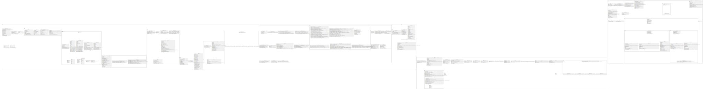
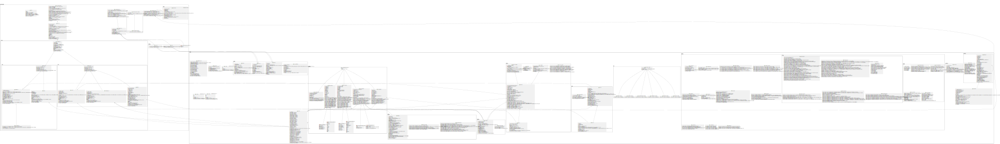

# IndieStudio

Engine & Raylib encapsulation for IndieStudio project

## Team

- [Alwyn Mattapullut](alwyn.mattapullut@epitech.eu) - **Leader**
- [Noa Olivette](noa.olivette@epitech.eu) - **Developer**
- [Nicolas Reboulé](nicolas.reboule@epitech.eu) - **Developper**
- [Hugo Baret](hugo.baret@epitech.eu) - **Developper**
- [Quentin Robert](quentin.robert@epitech.eu) - **Missing Person**
- [Nicolas Julie](nicolas.julie@epitech.eu) - **Missing Person**

## Wiki

*See the files in the examples tabs, the files below is the example files detailled by doxygen*

## Uml

### Full project Uml

### Raylib-CPP + GameEngine UML

