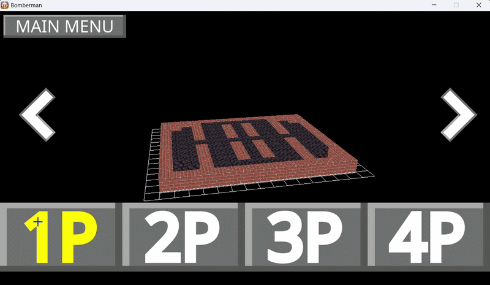
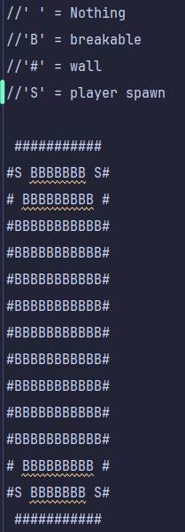

# IndieStudio

Epitech project to recreate an indie studio. The project is a bomberman game.



## Goals of the project

The goal of the project was to create a C++ wrapper for the Raylib and use it to create a bomberman game.

The wrapper should be easy to understand and use. It can be found in the [raylib-cpp/src/raylib](https://github.com/NicolasReboule/IndieStudio/tree/master/raylib-cpp/src/raylib) and [raylib-cpp/include/raylib](https://github.com/NicolasReboule/IndieStudio/tree/master/raylib-cpp/include/raylib) folders.

We also created a simple [node based game engine](https://github.com/NicolasReboule/IndieStudio/tree/master/raylib-cpp/include/GameEngine) to develop the game.

## Team

- [Alwyn Mattapullut](alwyn.mattapullut@epitech.eu) - **Leader**
- [Noa Olivette](noa.olivette@epitech.eu) - **Developer**
- [Nicolas Reboulé](nicolas.reboule@epitech.eu) - **Developer**
- [Hugo Baret](hugo.baret@epitech.eu) - **Developer**
- [Quentin Robert](quentin.robert@epitech.eu) - **Developer**
- [Nicolas Julie](nicolas.julie@epitech.eu) - **Developer**

## Documentation

The documentation is available [here](https://alwyn974.github.io/IndieStudio).

## Requirements

- OpenGL
- CMake 3.17+
- CPack

## Build

If you want to build the game you can run the following command:

```
git clone https://github.com/NicolasReboule/IndieStudio.git
cd IndieStudio
mkdir build
cd build
cmake ..
cmake --build . --config Release
```

The binary will be in the build/ directory. <br>
On Windows `build\Release\bomberman.exe` will build the game. You will need to move the executable to the root <br>
On Linux `build/bomberman` will build the game. No need to move the executable.

## Install

If you want to install the game you can run the following command:

```bash
git clone https://github.com/alwyn974/IndieStudio.git
cd IndieStudio
mkdir build
cd build
cmake ..
cpack
```

At the root of the repository a `dist` directory will be created. It contains the game installer.

## Play

The game should be played in multiplayer as we did not put much effort in the AI.

Each player should use a controller for controls.

### Add a map

You can add your own map by adding a txt file to the map folder.

It should follow this format.


